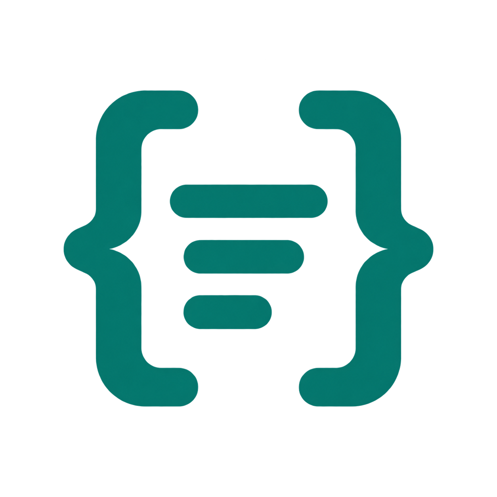
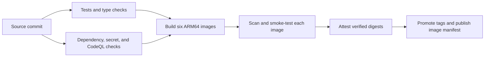

<h1> DevFeed</h1>

### Follow the ideas. Find your next worthwhile read.

Developer news, tutorials, and releases, organized around your interests. 
Built for curious readers—and for people who care how software reaches production.

**[Explore DevFeed](https://devfeed.tech)** · **[Run your own](docs/compose.md)** · **[Documentation](docs/development.md)** · **[Releases](https://github.com/abhi1693/devfeed.tech/releases)**

---

Software moves quickly. Keeping up should leave you with something worth reading.

DevFeed brings RSS and Atom publications into a searchable developer feed. Follow
the topics and sources that matter to you, find a useful article, and continue
reading at the original publisher. Behind the feed, a separate administration app
handles source review, topic research, publication decisions, and pipeline health.

## Make the feed yours

- **Start reading immediately.** Browse, search, and explore topics and sources
  without an account. Preview an article before opening the original.
- **Follow your interests.** Sign in to follow sources and topics, like articles,
  and receive recommendations informed by those choices.
- **Choose what belongs in your feed.** Select articles, news, tutorials, releases,
  comparisons, and opinions. Switch between cards and a compact list, with light,
  dark, or system appearance.
- **Bring a good source with you.** Signed-in readers can suggest feeds. Validation
  checks the URL and feed before submission; suggestions enter an approval workflow.

[Reader accounts and preferences →](docs/user-accounts.md)

## From discovery to publication, with a reason for every decision

An imported feed entry starts as a candidate. DevFeed preserves its provenance,
enriches its metadata, and can use AI to assess developer relevance and research
its topics. Model responses pass structured validation; topic research has a
separate stage to verify evidence.

Operators can review decisions themselves or enable full automation. In full mode,
application policies control admission and publication. Unresolved research enters
bounded correction and verification cycles, with the evidence and outcome retained.

Three details make the process inspectable:

- **Research leaves a trail.** Topic proposals retain citations, proposed changes,
  verification results, and linked research runs.
- **Background work survives interruptions.** Durable jobs, leases, bounded retries,
  and scheduling that respects AI capacity let workers resume queued work after restarts.
- **Operations stay visible.** The admin overview connects publication trends,
  source output, queue pressure, and job reliability. Daily reported AI tokens are
  broken down by article analysis, topic analysis, and research verification.

[Automation and decision policies →](docs/automation.md) · [The admin overview →](docs/admin-overview.md)

## A release workflow you can inspect

The release process lives alongside the application. One CI entry point runs the
tests, security checks, and container workflow against the same source commit.

- **Test against real dependencies.** Backend integration tests use disposable
  PostgreSQL and Redis. Both web apps run tests, type checks, and production builds;
  the admin checks also detect generated API-client drift.
- **Verify the artifact that will run.** Every runtime image receives vulnerability
  and secret scans, an SBOM, and native ARM64 smoke tests before promotion.
- **Keep image identity traceable.** Publishing runs attach build provenance to
  verified digests and produce an image manifest for downstream deployment.
  Version tags are write-once; branch tags advance after verification.
- **Make completion explicit.** The `CI required` gate requires the test, security,
  and container workflows to succeed. Pull requests verify images without publishing.

The diagram shows the publishing path. Creating a GitHub release and deploying
services are separate, deliberate operations.

[Read the workflow and its verification gates →](docs/ci.md)

## Run it on your terms

DevFeed combines **Next.js and React** interfaces with **FastAPI**, **PostgreSQL**,
and **Redis/RQ**. Public discovery, user accounts, and administration have separate
API services. User and admin sign-in use independent OIDC applications and server
sessions; AI workers connect to a dedicated Codex service.

Use Docker Compose for a complete local stack, or follow the Kubernetes guide for
service boundaries and production configuration. Published application images target
**Linux ARM64**. AI features require a configured Codex service and account.

| Start here | What you’ll find |
| --- | --- |
| [Docker Compose](docs/compose.md) | Bring up your own instance |
| [Development](docs/development.md) | Repository structure, setup, and contributor reference |
| [Kubernetes](docs/kubernetes.md) | Production configuration and service boundaries |
| [Editorial workflow](docs/editorial.md) | Classification, review, and publication |
| [Recommendations](docs/recommendations.md) | How followed interests become a personalized feed |
| [Release process](docs/releases.md) | Versioning and release preparation |

## Help shape what comes next

Found a publication worth following? [Suggest it](https://github.com/abhi1693/devfeed.tech/issues/new?template=03_source_suggestion.yml).
Have an idea for a better reading experience? [Open a feature request](https://github.com/abhi1693/devfeed.tech/issues/new?template=02_feature_request.yml).
Found a problem? [File a bug](https://github.com/abhi1693/devfeed.tech/issues/new?template=01_bug_report.yml)
or [join the discussion](https://github.com/abhi1693/devfeed.tech/discussions).

Contributions to the reading experience, feed compatibility, accessibility,
documentation, and operational tooling are welcome. The
[development guide](docs/development.md) is the place to begin.
