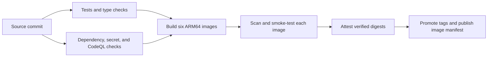

<h1><a href="https://devfeed.tech"> DevFeed</a></h1>

### Follow the ideas. Find your next worthwhile read.

Developer news, tutorials, and releases, organized around your interests. 
Built for curious readers—and for people who care how software reaches production.

**[Explore DevFeed](https://devfeed.tech)** · **[Run your own](docs/compose.md)** · **[Documentation](docs/development.md)** · **[Releases](https://github.com/abhi1693/devfeed.tech/releases)**

[Contributing](CONTRIBUTING.md) · [Security](SECURITY.md) · [Terms of Service](https://devfeed.tech/legal/terms) · [Privacy Policy](https://devfeed.tech/legal/privacy)

---

Software moves quickly. Keeping up should leave you with something worth reading.

DevFeed brings RSS and Atom publications into a searchable developer feed. Follow
the topics and sources that matter to you, find a useful article, and continue
reading at the original publisher. Behind the feed, a separate administration app
handles source review, topic research, publication decisions, and pipeline health.

## Make the feed yours

- **Start reading immediately.** Browse, search, and explore topics and sources
  without an account. Preview an article before opening the original.
- **Find the right result.** Search articles, topics, sources and tags together,
  with typo tolerance and articles given priority. [Self-hosted search →](docs/search.md)
- **Follow your interests.** Sign in to follow sources and topics, like articles,
  and receive recommendations informed by those choices. Recommendations refresh every six hours
  after an immediate first build. Likes, follows, feed settings, and catalogue updates wait for
  the scheduled refresh and do not replace an open feed.
- **Choose what belongs in your feed.** Select articles, news, tutorials, releases,
  comparisons, and opinions. Switch between cards and a compact list, with light,
  dark, or system appearance.
- **Bring a good source with you.** Signed-in readers can suggest feeds. Validation
  checks the URL and feed before submission: at least three distinct usable entries and
  one entry dated within the last three calendar months are required. Suggestions enter
  an approval workflow. The same checks apply to admin, CLI, Chrome, Edge, and feeds
  found through publisher website discovery. Missing or future dates do not qualify.

[Reader accounts and preferences →](docs/user-accounts.md)

[Use DevFeed as your Chrome new tab →](apps/extensions/README.md)

## From discovery to publication, with a reason for every decision

An imported feed entry starts as a candidate. DevFeed preserves its provenance,
enriches its metadata, and can use AI to assess developer relevance and research
its topics. Model responses pass structured validation; topic research has a
separate stage to verify evidence.

Operators can review decisions themselves or enable full automation. In full mode,
application policies control admission and publication. Unresolved research enters
bounded correction and verification cycles, with the evidence and outcome retained.

Every new source starts pending, whether added through the admin, CLI, an import,
or a reader suggestion. A successful feed lookup does not approve it. Ingestion
starts only after an operator approves it or AI review records a supported approval.

Three details make the process inspectable:

- **Research leaves a trail.** Topic proposals retain citations, proposed changes,
  verification results, and linked research runs.
- **Background work survives interruptions.** Durable jobs, leases, bounded retries,
  and scheduling that respects AI capacity let workers resume queued work after restarts.
- **Operations stay visible.** The admin overview connects publication trends,
  source output, queue pressure, and job reliability. Daily reported AI tokens are
  broken down by article analysis, topic analysis, and research verification.

[Automation and decision policies →](docs/automation.md) · [The admin overview →](docs/admin-overview.md)

## A release workflow you can inspect

The release process lives alongside the application. One CI entry point runs the
tests, security checks, and container workflow against the same source commit.

- **Test against real dependencies.** Backend integration tests use disposable
  PostgreSQL and Redis. Both web apps run tests, type checks, and production builds;
  the admin checks also detect generated API-client drift.
- **Verify the artifact that will run.** Every runtime image receives vulnerability
  and secret scans, an SBOM, and native ARM64 smoke tests before promotion.
- **Keep image identity traceable.** Publishing runs attach build provenance to
  verified digests and produce an image manifest for downstream deployment.
  Version tags are write-once; branch tags advance after verification.
- **Make completion explicit.** The `CI required` gate requires the test, security,
  and container workflows to succeed. Pull requests verify images without publishing.

The diagram shows the publishing path. Creating a GitHub release and deploying
services are separate, deliberate operations.

[Read the workflow and its verification gates →](docs/ci.md)

## Run it on your terms

DevFeed combines **Next.js and React** interfaces with **FastAPI**, **PostgreSQL**,
and **Redis/RQ**. Public discovery, user accounts, and administration have separate
API services. User and admin sign-in use independent OIDC applications and server
sessions; AI workers connect to a dedicated Codex service.

Use Docker Compose for a complete local stack, or follow the Kubernetes guide for
service boundaries and production configuration. Published application images target
**Linux ARM64**. AI features require a configured Codex service and account.

| Start here                                 | What you’ll find                                          |
| ------------------------------------------ | --------------------------------------------------------- |
| [Docker Compose](docs/compose.md)          | Bring up your own instance                                |
| [Development](docs/development.md)         | Repository structure, setup, and contributor reference    |
| [AI-readable content](docs/ai-content.md)  | Markdown pages, agent discovery and cached public content |
| [Kubernetes](docs/kubernetes.md)           | Production configuration and service boundaries           |
| [Editorial workflow](docs/editorial.md)    | Classification, review, and publication                   |
| [Recommendations](docs/recommendations.md) | How followed interests become a personalized feed         |
| [Release process](docs/releases.md)        | Versioning and release preparation                        |

## Help shape what comes next

Found a publication worth following? [Suggest it](https://github.com/abhi1693/devfeed.tech/issues/new?template=03_source_suggestion.yml).
Have an idea for a better reading experience? [Open a feature request](https://github.com/abhi1693/devfeed.tech/issues/new?template=02_feature_request.yml).
Found a problem? [File a bug](https://github.com/abhi1693/devfeed.tech/issues/new?template=01_bug_report.yml)
or [join the discussion](https://github.com/abhi1693/devfeed.tech/discussions).

Contributions to the reading experience, feed compatibility, accessibility,
documentation, and operational tooling are welcome. The
[development guide](docs/development.md) is the place to begin.

Operational dashboards, private metrics, traces, logs and continuous profiling are
covered in [Production observability](docs/observability.md).

### Pause article-derived topic proposals

Set `DEVFEED_ARTICLE_TOPIC_PROPOSALS_ENABLED=false` on backend workers, the scheduler,
and admin API to pause new proposals from article tags and processing/approval of
pending `article_enrichment` and legacy `ai_analysis` proposals. This independent
switch remains off even with full automation enabled. Existing drafts and queued jobs
are retained; queued work waits without consuming analysis attempts. Imported proposals,
existing topics, article ingestion, and classification against existing topics continue.
Set it back to `true` to resume. This does not impose a minimum article-count policy.

### 0.0.28 operational fixes

This release fixes strict-schema failures in source assessments, preserves verifiable
passage references for article title rewriting, and clarifies software/product audience
scope. Topic proposals with an adverse saved scope verdict cannot bypass review through
manual approval. Article-generated proposals can be paused independently of full automation.

Public reads release database connections before cache writes, transient database apply
failures retry without repeating inference, and worker health probes use a local parent
heartbeat. Public reader cache headers are shared by the website and Chrome/Edge extensions.
Microsoft account linking remains an identity-provider configuration issue; this release
does not change account ownership or authentication policy.

Production health changes in 0.0.29 add request metrics to user/admin APIs and
embed frontend package versions in telemetry. Faro keeps static admin route
labels while removing IDs and query strings. Analysis candidate matching indexes
immutable normalized terms and scans each article field once, preserving scores,
overlapping aliases and catalog-edit invalidation without caching eligibility.
A synthetic 3,000-entry catalog benchmark improved from about 153ms to 4ms per
article; verify actual scheduler cycle time and profiles after rollout.

Coordinate deployment with the home-lab GitOps connection policy below,
Loki delivery headroom/alerts and retained PostgreSQL volume expansion. Verify
application pool timeouts separately from SQL execution errors. Topic-proposal
pauses and protected analysis-history retention remain unchanged.

### PgBouncer connection policy (prepared, not deployed)

SQLAlchemy now defaults to `NullPool` for APIs and workers. Closing a session releases
the client socket so session-mode PgBouncer can reuse its PostgreSQL backend. Set
`DEVFEED_DATABASE_POOL_ENABLED=true` only for an explicitly budgeted direct PostgreSQL
deployment. Local pool size/overflow/timeout settings have no effect with `NullPool`.
The per-connection statement timeout remains 30 seconds; transaction-mode PgBouncer
is not enabled because that timeout currently relies on session state.

HTTP concurrency is controlled separately: `DEVFEED_API_MAX_CONCURRENT_REQUESTS`
defaults to 16 per process; staged production uses 16 for public and 8 for private APIs. Excess
requests fail immediately with an uncacheable 503 and `Retry-After: 1`, before entering
a handler or sync worker thread. Notification streams have a separate 32-request
budget so their 25-second connections do not consume interactive capacity. Liveness
bypasses admission; readiness uses the ordinary budget. These limits bound work,
not server connections: admin background reporting remains separately limited.
Do not raise RQ worker replicas to compensate for DB wait; each worker executes one
job at a time, and scheduler/indexer/reporting need part of the same backend budget.

All API dependency sessions close after serialization and before response transmission;
readiness releases its DB connection before Redis I/O. Acquisition and hold-time metrics
cover both pool implementations. `devfeed_http_admission_rejections_total{service,kind}`
distinguishes admission overload from database acquisition and SQL errors.

Stage with the companion GitOps change: keep session mode and server-pool capacity,
set `query_wait_timeout=2` on the DevFeed PgBouncer poolers, and remove API overflow
overrides. Roll one API service at a time only after a release is authorized. Do not
apply the admission settings to an old image that does not implement them. Monitor
HTTP failure/admission rates, acquisition/hold durations, PgBouncer waiting, PostgreSQL
lock waits and durable worker outcomes during load and loss of one pooler instance.
A successful synthetic test is not proof that all production long transactions are fixed.

Run `DEVFEED_TEST_DATABASE_FAILURES=1 uv run pytest -q -s
tests/test_database_pooler_recovery.py` (on one line) for disposable PostgreSQL/PgBouncer
contention, mixed API/worker load, connection replacement, queue timeout, lock cancellation
and network-loss recovery tests. Tests never use production credentials or replay writes.
No migration, release tag or application image rollout accompanies this source change.
