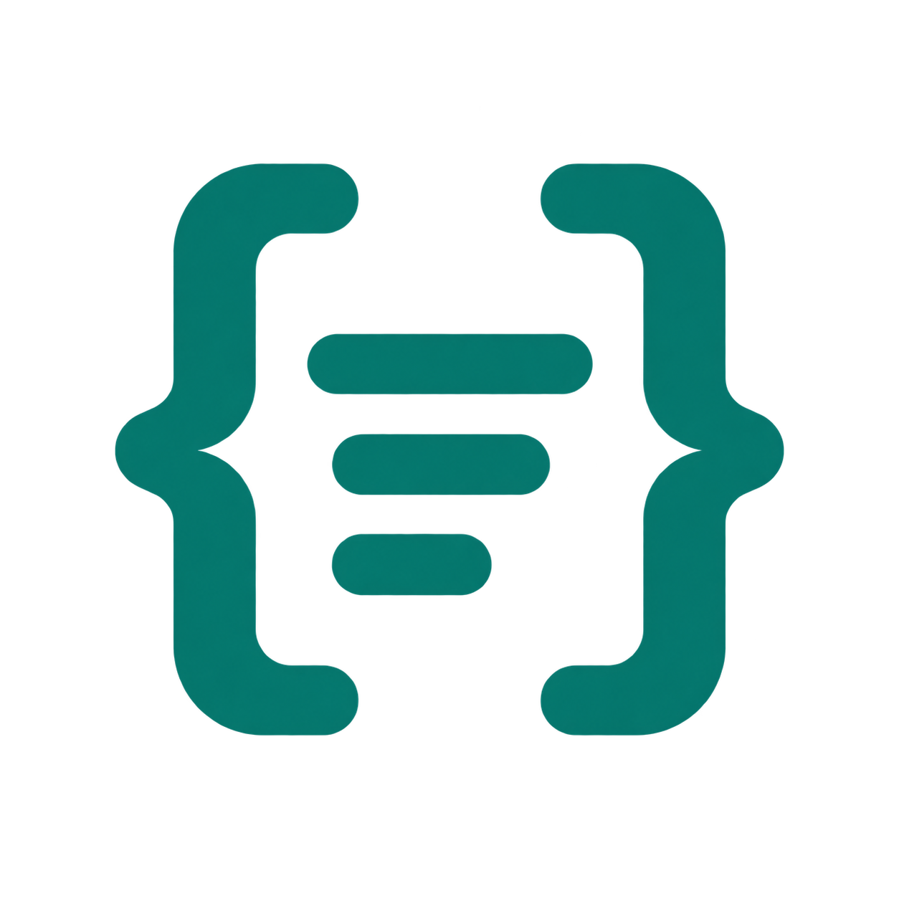

<h1><a href="https://devfeed.tech"> DevFeed</a></h1>

### Follow the ideas. Find your next worthwhile read.

A personal reading feed for developer news, tutorials, and releases.

**[Explore DevFeed](https://devfeed.tech)** · **[Run your own](compose.yaml)** · **[Releases](https://github.com/abhi1693/devfeed.tech/releases)**

[Contributing](CONTRIBUTING.md) · [Security](SECURITY.md) · [Terms](https://devfeed.tech/legal/terms) · [Privacy](https://devfeed.tech/legal/privacy)

---

DevFeed brings RSS and Atom publications into one searchable place. Follow the
sources and topics you care about, find something worth reading, and continue at
the original publisher. Browse without an account; sign in when you want a feed
that reflects your interests.

## Put your developer profile in your README

Show the tools and technologies you use with a public DevFeed profile. Add your
stack, claim a username, and share your live Dev Card wherever you introduce your
work. Here’s mine:

[Create your profile](https://devfeed.tech/settings/profile) · [See the profile behind this card](https://devfeed.tech/users/asaharan)

## Make the feed yours

- **Browse right away.** Explore articles, topics, and sources without signing in.
- **Find useful reads.** Search articles, topics, sources, and tags together, with
  typo-tolerant results.
- **Follow your interests.** Build a personal feed from the topics and publications
  you follow, with recommendations based on those choices.
- **Choose how to read.** Switch between cards and a compact list, and use light,
  dark, or system appearance.
- **See your reading rank.** Compare longest streaks and total reading days among
  readers with a public profile, claimed username, and recorded reading activity.
  Each leaderboard shows your rank in the list, or below it when you are outside
  the displayed ten readers.
- **Bring a source with you.** Suggest an RSS or Atom feed for review from the web
  app or browser extensions.

[Chrome and Edge extensions →](apps/extensions/README.md)

## Connect your AI assistant

Run the [DevFeed MCP server](apps/mcp/README.md) to search developer articles,
browse topics and publications, and retrieve previews with original publisher
links from an MCP client. The separate service exposes six public, read-only tools.

## A thoughtful home for developer reading

DevFeed keeps articles connected to their original publications and makes it easy
to explore what’s happening across technologies and communities. Articles are
organized into news, tutorials, releases, comparisons, and opinions, so you can
choose the kind of reading you’re in the mood for.

## Run it on your terms

DevFeed combines **Next.js and React** with **FastAPI**, **PostgreSQL**, and
**Redis/RQ**. [Run your own instance with Docker Compose](compose.yaml).

[Configure OpenTelemetry and service metrics](packages/core/OBSERVABILITY.md).

## Help shape what comes next

Found a publication worth following? [Suggest it](https://github.com/abhi1693/devfeed.tech/issues/new?template=03_source_suggestion.yml).
Have an idea for a better reading experience? [Open a feature request](https://github.com/abhi1693/devfeed.tech/issues/new?template=02_feature_request.yml).
Found a problem? [File a bug](https://github.com/abhi1693/devfeed.tech/issues/new?template=01_bug_report.yml)
or [join the discussion](https://github.com/abhi1693/devfeed.tech/discussions).

Contributions to the reading experience, feed compatibility, accessibility, and
documentation are welcome. Start with [CONTRIBUTING.md](CONTRIBUTING.md).

## Partner portal

The standalone partner portal and API expose membership-scoped product/ad analytics,
and partnership tiers. Superusers manage accounts in the admin application. See [portal setup and access model](apps/partner/README.md).

Configure product API endpoints, mappings, pagination and authentication in the admin app.
See [partner API connectors](packages/core/PARTNER_CONNECTORS.md) for setup and supported contracts.
