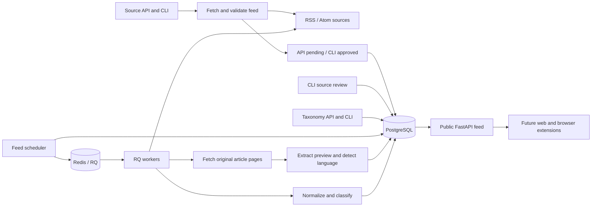

# Aggregation architecture

The current publication and classification layer is described in
[editorial publication, topics, and AI analysis](editorial.md). Ingestion stores
private candidates; reader queries require explicit approval and publication.
The analysis worker uses a separate RQ queue and never receives publishing authority.

## Responsibilities

Source creation through either the API or CLI first downloads and parses the feed
synchronously, before any database writes. Admission requires HTTP 200 and readable
RSS/Atom. A nonempty feed must contain at least one usable article; a valid empty
feed is accepted. Failed preflight creates neither a source nor an ingestion job.
Bulk CLI imports validate every unique URL before opening the write transaction.

Source creation accepts an optional name. Shared preflight returns the parsed
feed title as well as validation results, so naming reuses the same HTTP response.
Explicit names win; otherwise a cleaned, bounded RSS channel/Atom feed title is
used, with the submitted hostname as the fallback for untitled feeds. Creation
treats omitted, null and whitespace-only names as unspecified. Stored source names
remain required, and polling or resubmission never automatically renames a source.

API submissions start pending and create no ingestion or enrichment jobs. New CLI
additions/imports start approved, with an initial trusted-submission review record.
Duplicate CLI submissions preserve the original decision and attribution. Explicit
CLI approval enables polling and queues work; rejection disables polling. The
scheduler, refresh services, worker claim and final ingestion transaction enforce
approval independently of `enabled`. Worker writes lock and recheck the source so
a rejection committed during HTTP fetching prevents importing those results.
Review history is append-only through the application, not an authenticated audit
log. Existing articles and provenance are retained after rejection.

Source profiles reuse generic RSS/Atom metadata at admission. Separate durable RQ
jobs fill missing description, website, logo, image and language fields from the
feed and declared website metadata. Manual values and review/submitter fields are
never overwritten; network work happens outside database transactions. Profile
failures/retries do not affect RSS validators or ingestion backoff. See
[source profiles and review](sources.md) for the lifecycle and limits.

Every source has one required semantic type, separate from its RSS/Atom format:

| Type | Meaning | Current normalization |
| --- | --- | --- |
| `publisher` | Publishes the linked content, e.g. DEV.to | Feed byline, summary and publication date are publication candidates |
| `aggregator` | Shares/discusses links, e.g. HN or Lobsters | Preserve submitter, submission date, description, tags and discussion URL as source-entry evidence; do not promote them to article facts |

Types are selected explicitly through API `source_type` or CLI `--type`, never
inferred from a brand, hostname or feed format. Preflight and workers pass the
same type to the shared parser. Safe RSS/Atom transport is shared; selecting
`aggregator` does not weaken URL checks or follow arbitrary description links.
Native discussions are retained, not automatically reinterpreted as publisher
entries based on hostname equality. Type is immutable until a reprocessing
workflow exists; conflicting duplicate submissions are rejected.

Publisher image discovery is an independent RQ stage for missing images; see
[image discovery](images.md). Aggregator records enqueue [original-page enrichment](articles.md)
in the ingestion transaction, after storing source-entry provenance. One page fetch
extracts title, short preview, author, explicit publication time, image and language.
Source types remain publisher/aggregator; `Article.metadata_source_type='page'`
marks extracted original-page metadata below publisher RSS in merge precedence.
Optional analysis now assesses developer relevance and contextual classification
before operator publication. Credibility scoring and personalized ranking remain deferred.

Core owns the shared fetcher, parser, validation, models and domain services. The
API does not import the worker package. The aggregator handles recurring ingestion,
classification and article persistence in the background. Preflight does not save
articles or ETag/Last-Modified headers: the initial worker run must retrieve the
body, not receive a 304 for articles that have never been imported. Workers retain
their own error handling because a previously validated feed can become unavailable.

`apps/cli` depends on core and the aggregator, not the API. CLI and HTTP writes share
schemas and transactional domain services, including source/job locking and taxonomy
validation. After preflight, CLI submission is an idempotent database operation that
queues durable work for enabled, approved sources. The CLI can start worker and scheduler processes and inspect
their status without an HTTP server; see the [CLI guide](cli.md).

`DEVFEED_DATABASE_URL` and `DEVFEED_REDIS_URL` are required configuration, read from
the environment or `.env`, with no fallback connection strings. Missing or blank
values fail settings validation before connections are created. These URLs are the
only database/Redis connection settings; there are no separate credentials, host,
port or database-name variables. Service provisioning is outside the repository.

PostgreSQL owns sources, immutable article identities, provenance, classification
and durable ingestion jobs. Redis transports RQ jobs and stores scheduler heartbeats.
There are no account/session models, authentication routes or password utilities.
Source-specific review history is stored without an account dependency; source
editing, decisions and manual refresh are CLI-only. The API exposes approved source
profiles and pending submission receipts, not review/submitter internals. Taxonomy
writes and job inspection remain private/local endpoints with no account requirement.

## Delivery and recovery

1. The scheduler locks due, enabled and approved source rows with `FOR UPDATE SKIP LOCKED` and creates
   queued ingestion rows. A partial unique index permits only one queued/running
   ingestion per source. Explicit source refresh requests use the same path.
2. Committed queued rows act as an outbox. The scheduler publishes their IDs to RQ
   and stamps dispatch afterward. A failed publish leaves the row available.
3. A worker atomically claims a queued row and obtains a unique lease token. It
   downloads and parses outside the transaction, then checks ownership again.
4. Articles, provenance, category assignments, source validators and success status
   commit together. Duplicate delivery after success is a no-op; simultaneous
   claims are exclusive. The unique canonical URL hash deduplicates across feeds.
5. A failed download or transaction rolls back article writes. Transient errors
   retry up to three attempts, with 30/60-second delays. A bounded `Retry-After`
   can extend this delay. Permanent HTTP/parsing failures fail the run immediately.
6. Exhausted/failed runs increase the source's polling delay exponentially, capped
   at 24 hours. A successful run restores its configured interval. Sources are not
   silently deleted or permanently disabled by automated failure handling.
7. RQ kills jobs exceeding 180 seconds; the database lease lasts 300 seconds.
   Expired leases are retried or finalized at the attempt limit. The old lease
   token cannot commit after a recovered worker acquires ownership.
8. Queued messages have a five-minute TTL and are republished after five minutes
   without a claim. Redis loss can therefore be recovered from PostgreSQL. Duplicate
   messages are expected and safe; delivery is at least once, not exactly once.

The scheduler runs every 15 seconds, in bounded batches of 100. Multiple scheduler
processes use row locks safely, though one is sufficient initially. Worker replicas
each process one ingestion at a time. With multiple workers, the database claim
prevents concurrent fetching of the same source. There is no cross-source hostname
rate limiter yet; choose sensible intervals when adding feeds on the same host.

Manual CLI dispatch (`sources fetch --force` or `jobs dispatch`) locks the queued
job and commits an explicit reset of its availability/dispatch delay. It then uses
the same dispatch function as the scheduler, restricted to that job ID. This
second transaction waits for concurrent ownership and rechecks queued eligibility;
running leases are never stolen. Source-row locks from submission are released
before acquiring the job lock, matching the worker's lock ordering. Broker failure
leaves a durable ready job, and scheduler/worker races coalesce. The operation does
not execute a scheduler tick, update its heartbeat or start any process. The CLI
override also bypasses retry/Retry-After delays; normal background behavior is unchanged.

RQ uses JSON serialization. Only ingestion/image/source-profile job IDs are sent through Redis. Database
ingestion status is authoritative; a handled fetch failure may be a successful RQ
function execution while the database job is queued for retry or marked failed.

## Content model

- Canonical URLs remove fragments and common tracking parameters while preserving
  meaningful path/query differences. HTTP and HTTPS are not assumed equivalent.
- Feed GUIDs (scoped to a source) and URL hashes provide complementary deduplication.
  A changed URL on an already imported GUID does not create a new article. This
  version keeps first-imported publisher metadata; feed edits do not overwrite it.
  A publisher entry upgrades an aggregator placeholder or extracted page at the same canonical URL.
  Aggregator entries never overwrite publisher metadata. General evidence-ranked
  merging and revision-based updates remain future work.
- Multiple sources can point at one article. Original feed links are retained in
  provenance, while reader responses expose canonical links, source types and
  `origins[].source_metadata`. This bounded normalized evidence includes supplied
  tags even if no configured taxonomy matches them; it is not a raw-feed archive.
- Publisher feeds supply title, a plain-text excerpt capped
  at 2,000 characters, author, publication time and optional media image.
  Aggregator enrichment downloads HTML transiently, retaining only a short preview
  and bounded extraction evidence. There is no image downloading or full-text republishing.
- Invalid individual entries are skipped and counted. Responses are capped at
  5 MB (both wire and decompressed size; gzip is supported) and processing at 500
  entries per feed; overflow entries are counted as
  skipped. Feed pagination/backfill is not yet implemented. A valid empty feed is
  accepted; malformed non-feed responses fail the run.
- Missing/invalid/future publication timestamps remain null. An update timestamp
  is not substituted for a publication timestamp. Aggregator dates describe the
  submission, not publication. Feed ordering uses a separate `feed_at`, initialized
  from a valid entry publication/submission date, update date, or discovery time
  in that order. It does not change when better publication metadata arrives.
  Article language is inferred offline from publisher text in the ingestion worker,
  after parsing and before the database transaction. The model is initialized lazily
  per process, never during API preflight or a GET. Unknown/uncertain language stays
  null. All feed-declared languages remain source-entry evidence, not article facts.
  Discovery-only submissions require publisher text before language can be inferred.
  The [bounded CLI backfill](languages.md) uses the same policy to correct older
  records without re-fetching feeds, reordering articles or resetting the database.
- Categories and tags are database-managed and start empty. Categories form an
  adjacency-list hierarchy using `parent_id`; each has editable keyword rules.
  Tags have editable names, slugs, aliases and an optional category. Workers read
  both tables for each ingestion. There is no static taxonomy or default seed.
  Article/tag relationships use a join table with foreign keys, so renaming a
  tag does not orphan existing assignments. Content type has its own
  conservative rules. These are baseline
  heuristics, not an ML relevance or quality classifier.
- Category/tag assignments can be empty, but publication still requires a primary
  topic, sufficient metadata and approval. Disabling a source stops polling while
  preserving imported articles; article moderation controls reader visibility.
- Matching-rule edits apply to newly imported entries. Tag renames, category
  reparenting and tag regrouping are reflected immediately in existing feed data.
  Historical reclassification,
  full-text indexing, semantic deduplication and learned ranking are future work.

Feed pagination uses `(feed_at, id)` as a stable descending cursor and filters
before limiting results. Full-text search uses PostgreSQL's English text search
configuration over titles/excerpts, with a GIN index; it is not multilingual semantic
search. Tag/category/source associations and parent links have filter indexes.

Category writes acquire a PostgreSQL table lock that serializes writers while
allowing ordinary reads. The taxonomy API validates the resulting tree before commit,
including the entire moved subtree. It rejects cycles, missing parents and trees
deeper than 16 levels. A self-parent check and parent foreign key also protect the
database. A recursive CTE makes category filters include all descendants, using
both direct category assignments and tags grouped in the subtree. Ancestor
assignments are computed from the current tree, rather than copied onto articles.

The consolidated `0001_initial` migration creates the current schema directly,
without former account tables, static taxonomy seeds or legacy transforms. It
requires an empty database; old pre-release databases must be reset explicitly.
Future changes add new revision files. App versions annotate revisions but do not
replace Alembic revision IDs. See [migration workflow](../migrations/README.md).

## Fetch safety and operations

Preflight and worker fetches use the same safeguards. They allow public HTTP(S) on
ports 80/443 only. The network backend resolves
the hostname once, rejects any nonpublic result, then connects to the checked
literal IP while preserving the original hostname for Host, TLS SNI and certificate
validation. Redirects are checked again; HTTPS downgrade redirects are rejected.
Environment proxy settings are not used. Conditional validators are not forwarded
across origins. Network timeouts, a download deadline and response limits apply to
both paths; RQ additionally enforces a hard job deadline. Apply egress controls to
the API, CLI and workers as additional protection beyond local development.

Validation errors omit input values. Job errors/logs contain IDs and error types
rather than article bodies,
database parameters or URL credentials. The API disables proxy-header trust by
default. Configure explicit trusted proxy addresses if deployed behind a reverse
proxy. CORS defaults to no cross-origin access; configure exact frontend origins
when those clients exist.

API, CLI, workers, scheduler and migrations share stderr logging, with plain text
for development and optional JSON. Requests, commands, scheduler ticks and ingestion
jobs have correlation fields; see the [logging guide](logging.md) for configuration,
levels and safe exception diagnostics.

`/health/ready` checks the database and Redis, not pipeline progress. Use
`/v1/ingestion/status` for queue depth, active-job age and scheduler heartbeat; use RQ's
worker inspection for worker registration/heartbeats. Alert on old queued jobs,
stale scheduler heartbeat and persistent source failures. Database job history
currently has no automatic retention policy; choose one before sustained high-volume
operation. Back up PostgreSQL. Configure Redis persistence and eviction policy in
the infrastructure that provides it.

The Dockerfile packages the API, CLI and worker/scheduler entrypoints in one image;
it does not provision dependencies or orchestrate services. Authentication and
access control must be revisited before public deployment, alongside TLS, backups
and explicit frontend origins. Apply migrations explicitly before application
startup. Do not have individual API/worker replicas create or mutate their schema.

Implementation references: [RQ workers](https://python-rq.org/docs/workers/),
[RQ queue options](https://python-rq.org/docs/),
[SQLAlchemy PostgreSQL upserts](https://docs.sqlalchemy.org/en/20/dialects/postgresql.html#insert-on-conflict-upsert),
[uv workspaces](https://docs.astral.sh/uv/concepts/projects/workspaces/).
