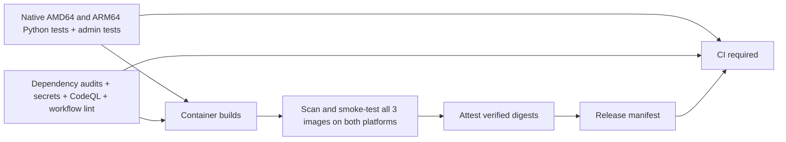

# CI and verified container images

`.github/workflows/ci.yml` is the single entry point for pull requests, the merge
queue, pushes to `master`, `v*` tags, manual runs, and a weekly maintenance run.
It calls the test, security, and container workflows from the same source commit.



Pull requests, merge queues and scheduled runs build and verify images locally;
they do not publish images or attestations. Their container verification result
feeds `CI required` directly. Publishing is restricted to `master` pushes,
version-tag pushes and manual runs on `master`. A version tag must equal the
version in `pyproject.toml`, for example `v0.0.1`.

Configure branch protection to require **CI required**. This final job runs even
when upstream jobs fail or are skipped, and requires all three reusable workflows
to succeed. There are no path filters that can leave required checks pending.
No `workflow_run` handoff or floating source checkout is used.

## Test and security gates

- The shared `abhi1693/actions` Python workflow runs Python 3.12 and uv 0.12.6 on
  native `ubuntu-24.04` and `ubuntu-24.04-arm` runners. Each runs version checks,
  Ruff lint/format checks, mypy, unit tests, and all integration tests.
- `scripts/ci/python-tests.sh` creates disposable PostgreSQL 18 and Redis 8
  containers, binds only localhost on random ports, waits for readiness, and
  cleans up on exit. Integration tests apply the real migrations to a dedicated
  `_test` database and use Redis database 15. Production credentials are unused.
  The ordinary `scripts/test.sh` still never provisions services.
- Admin checks regenerate the OpenAPI client and reject generated-file drift,
  run ESLint/TypeScript and all Vitest tests, and build Next.js. Python and admin
  JUnit reports are retained for 14 days. Empty reports and any skipped tests fail.
- `pip-audit` checks the locked Python workspace, including development tools;
  `npm audit` blocks high/critical advisories, including development dependencies.
  Gitleaks scans the full Git history with redaction. Three exact historical
  fingerprints in `.gitleaksignore` cover reviewed false positives in prose and
  a UUID variable reference (including the original explanatory comment); no file, rule, or commit is excluded wholesale.
  Actionlint checks workflows.
- CodeQL runs `security-extended` for Python, JavaScript/TypeScript, and GitHub
  Actions. SARIF is uploaded to GitHub code scanning and retained for 14 days.
  Any returned finding blocks the pipeline; a successful analysis command alone
  does not pass this gate. Generated code, build products and Python test fixtures
  are excluded from analysis in `.github/codeql.yml`.
- Trivy scans every runtime image on both platforms for high/critical OS and
  library vulnerabilities, including unfixed issues, and secrets. Each platform
  gets a CycloneDX SBOM and scan report retained for 30 days. Missing platforms,
  a mismatched architecture, or failed runtime smoke tests block the image set.
  Smoke tests check the backend version, admin API OpenAPI version, and admin
  sign-in page; they do not replace a future deployed-system readiness check.

## Image identity and downstream deployments

The three first-party images are:

| Image | Contents |
| --- | --- |
| `ghcr.io/abhi1693/devfeed.tech/backend` | Public API, aggregator, scheduler and CLI |
| `ghcr.io/abhi1693/devfeed.tech/admin-api` | Private administration API |
| `ghcr.io/abhi1693/devfeed.tech/admin` | Next.js administration UI |

The Chimely image in `infra/chimely` remains an independently published upstream
service, pinned by digest; this pipeline does not republish it.

Publishing uses the shared Docker workflow from `abhi1693/actions`. Every image
is a Linux AMD64/ARM64 OCI index and receives exactly one runtime tag:
`sha-<full-source-SHA>-<run-id>-<run-attempt>`. Retries create a new identity.
A failed-job rerun computes its tag in the build job itself, so it cannot reuse
a successful metadata job's earlier attempt number. Successful images can be
reused during a partial rerun; the manifest records each image's actual tag and
digest. There are no `latest`, branch, shortened-SHA, or mutable version aliases. Base
images and action references are pinned by digest/commit. The shared build cache
uses mutable `buildcache-*` tags solely as caches; never deploy these tags.

Images must be pushed before they can be independently pulled and verified on
both native architectures. Those are **candidates**, even though their unique
build tags already exist. A failed scan or smoke test produces no release
manifest. Do not deploy a candidate just because its tag exists in GHCR.

After all six image checks pass, GitHub provenance attestations are added to the
three index digests. Only after attestation succeeds does CI upload:
`release-manifest-<source-SHA>-<run-id>-<run-attempt>` (90-day retention).
Its JSON records the source revision, app version, run ID, per-image build tags,
platforms, and three `ghcr.io/...@sha256:...` references.

A future deployment workflow should depend on the successful CI run for the
exact source SHA, download that run's manifest, verify its repository/revision,
verify the image attestations with `gh attestation verify oci://<image>@<digest>
--repo abhi1693/devfeed.tech`, and deploy the recorded digest references. Persist
approved manifests in the deployment repository for long-term rollback history;
Actions artifacts are not a permanent release catalog. Never rebuild images
inside a deployment stage or resolve `master` again after testing.

GHCR tags can be overwritten by a principal with registry write permission.
Pipeline-generated tags are unique, but **digest references are the immutability
boundary**. There is no automatic image deletion, version-tag promotion, service
deployment, or database reset in these workflows.

## Maintenance and local validation

Dependabot proposes weekly action, uv, npm and Docker updates. Updating a base
image digest or a dependency produces a new source commit and new image set.
The weekly CI run rechecks the current source against refreshed vulnerability
advisories without publishing new candidates. An advisory blocks subsequent
publication until it is resolved; no broad ignore list or continue-on-error
bypass is configured.

Useful local commands:

```sh
uv sync --all-packages --locked
bash scripts/ci/python-tests.sh   # starts and removes disposable Docker services
npm ci
npm run admin:lint
npm run admin:test
npm run admin:build
go run github.com/rhysd/actionlint/cmd/actionlint@v1.7.12
```

Reusable workflows and action SHA pinning follow the
[GitHub reusable-workflow contract](https://docs.github.com/en/actions/how-tos/reuse-automations/reuse-workflows).
The platform build/verification approach follows
[Docker's multi-platform guidance](https://docs.docker.com/build/ci/github-actions/multi-platform/).
