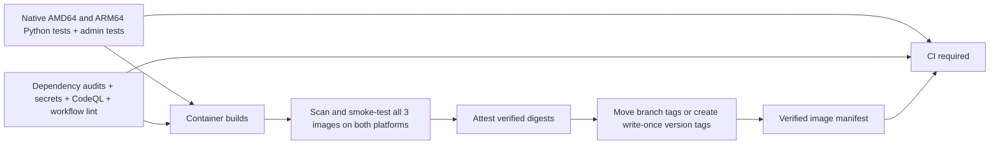

# CI and verified container images

`.github/workflows/ci.yml` is the single entry point for pull requests, the merge
queue, branch pushes, `v*` tags, manual runs, and a weekly maintenance run.
It calls the test, security, and container workflows from the same source commit.



Pull requests, merge queues and scheduled runs build and verify images locally;
they do not publish images or attestations. Their container verification result
feeds `CI required` directly. Trusted branch pushes, version-tag pushes and
manual branch runs publish verified images. Dependabot does not publish images.
A version tag must equal the
version in `pyproject.toml`, for example `v0.0.1`.

Configure branch protection to require **CI required**. This final job runs even
when upstream jobs fail or are skipped, and requires all three reusable workflows
to succeed. There are no path filters that can leave required checks pending.
No `workflow_run` handoff or floating source checkout is used.

## Test and security gates

- The shared `abhi1693/actions` Python workflow runs Python 3.12 and uv 0.12.6 on
  native `ubuntu-24.04` and `ubuntu-24.04-arm` runners. Each runs version checks,
  Ruff lint/format checks, mypy, unit tests, and all integration tests.
- `scripts/ci/python-tests.sh` creates disposable PostgreSQL 18 and Redis 8
  containers, binds only localhost on random ports, waits for readiness, and
  cleans up on exit. Integration tests apply the real migrations to a dedicated
  `_test` database and use Redis database 15. Production credentials are unused.
  The ordinary `scripts/test.sh` still never provisions services.
- Admin checks regenerate the OpenAPI client and reject generated-file drift,
  run ESLint/TypeScript and all Vitest tests, and build Next.js. Python and admin
  JUnit reports are retained for 14 days. Empty reports and any skipped tests fail.
- `pip-audit` checks the locked Python workspace, including development tools;
  `npm audit` blocks high/critical advisories, including development dependencies.
  Gitleaks scans the full Git history with redaction. Three exact historical
  fingerprints in `.gitleaksignore` cover reviewed false positives in prose and
  a UUID variable reference (including the original explanatory comment); no file, rule, or commit is excluded wholesale.
  Actionlint checks workflows.
- CodeQL runs `security-extended` for Python, JavaScript/TypeScript, and GitHub
  Actions. SARIF is uploaded to GitHub code scanning and retained for 14 days.
  Any returned finding blocks the pipeline; a successful analysis command alone
  does not pass this gate. Generated code, build products and Python test fixtures
  are excluded from analysis in `.github/codeql.yml`.
- Trivy scans every runtime image on both platforms for high/critical OS and
  library vulnerabilities, including unfixed issues, and secrets. Each platform
  gets a CycloneDX SBOM and scan report retained for 30 days.
  Image metadata also records uncompressed size per service/architecture for
  tracking footprint changes in job summaries and retained artifacts. Missing platforms,
  a mismatched architecture, or failed runtime smoke tests block the image set.
  Smoke tests check the backend version, admin API OpenAPI version, and admin
  sign-in page; they do not replace a future deployed-system readiness check.
  Smoke tests still run if scanning reports findings, while the failed security
  check continues to block the manifest. The admin runtime omits npm and Yarn.

## Image identity and downstream deployments

The three first-party images are:

| Image | Contents |
| --- | --- |
| `ghcr.io/abhi1693/devfeed.tech/backend` | Public API, aggregator, scheduler and CLI |
| `ghcr.io/abhi1693/devfeed.tech/admin-api` | Private administration API |
| `ghcr.io/abhi1693/devfeed.tech/admin` | Next.js administration UI |

The Chimely image in `infra/chimely` remains an independently published upstream
service, pinned by digest; this pipeline does not republish it.

Publishing uses the existing `docker-build-push.yml` in `abhi1693/actions`.
DevFeed passes a JSON matrix of `runner`/`platform` pairs for native AMD64 and
ARM64 builds. The shared workflow defaults to ARM64 when no matrix is supplied;
legacy `runs-on`/`platforms` inputs still work. It assembles the exact platform
digests into one OCI index and returns its digest. Job names identify each
service, platform, and index assembly step.

There are two publication channels:

| Source | Published tag | Update policy |
| --- | --- | --- |
| `master` branch | `master` | Moves to the newly verified image digest |
| Other branches | `branch-<sanitized-name>-<name-hash>` | Moves as that branch changes; hash prevents name collisions |
| Version tag, such as `v0.0.1` | `v0.0.1` | Write-once; never replace it with a different digest |

Before promotion, builds use internal `candidate-<SHA>-<run>-<attempt>` tags,
with a platform suffix on intermediate images. These identify scan inputs and
support partial reruns; they are not released version tags. Branch images are
not treated as immutable releases. There is no automatic `latest` alias.

The promotion job is serialized per Git ref. It checks all three target tags
before writing, allows an existing release tag only when its digest is identical,
and verifies every promoted digest. Authentication/network failures are fatal,
not interpreted as missing tags. A failed-job rerun can finish an interrupted
promotion idempotently; rebuilding an already released version with different
bytes is rejected. Publish a new version instead. The release guard applies to
these workflows; GHCR itself permits principals with write access to move tags.
Deploy digest references when immutability is required.

All Dockerfiles use multiple stages and pin Alpine 3.24 images. Python uses the
official `python:3.12-alpine3.24` image; locked native dependencies provide musl
wheels for both architectures. All runtime stages apply available Alpine package
fixes newer than the pinned base images. Runtime smoke tests exercise TLS certificates,
the database driver, validation/event-loop extensions, article extraction,
language detection, and admin signing to catch libc compatibility failures.
Python builder stages install locked
third-party dependencies before copying application code, then build workspace
packages. Runtime stages copy only the installed environment and required
runtime files, run as an unprivileged user, and contain no uv/build workspace.
Next.js builds on `node:22-alpine3.24`; its runtime starts from plain Alpine and
copies only Node and the standalone output, with CA certificates and libstdc++.
Package managers and Node headers never enter the runtime layers. Matching
builder/runtime Alpine versions avoids mixing incompatible native binaries.
This follows the Node image maintainers' [minimal-runtime pattern](https://github.com/nodejs/docker-node/blob/main/docs/BestPractices.md#smaller-images-without-npmyarn).
BuildKit uv/npm cache mounts accelerate dependency installation; the shared
workflow exports build layers to registry and GitHub Actions caches, separated
by service/platform. `buildcache-*` tags are mutable caches, not deployment tags.
Base images and action references are pinned by digest/commit and updated through
Dependabot.

Images must be pushed before they can be independently pulled and verified on
both native architectures. Those are **candidates**, even though their unique
build tags already exist. A failed scan or smoke test produces no verified
image manifest or branch/release tag promotion. Do not deploy a candidate just because its tag exists in GHCR.

After all six image checks pass, GitHub provenance attestations are added to the
three index digests. After attestation and tag promotion succeed, CI uploads:
`image-manifest-<source-SHA>-<run-id>-<run-attempt>` (90-day retention).
Its JSON records the source revision, app version, run ID, candidate/published
tags, the `immutable_release` flag, platforms, and three digest references.

A future deployment workflow should depend on the successful CI run for the
exact source SHA, download that run's manifest, verify its repository/revision,
verify the image attestations with `gh attestation verify oci://<image>@<digest>
--repo abhi1693/devfeed.tech`, and deploy the recorded digest references. Persist
approved manifests in the deployment repository for long-term rollback history;
Actions artifacts are not a permanent release catalog. Never rebuild images
inside a deployment stage or resolve `master` again after testing.

GHCR tags can be overwritten by a principal with registry write permission.
**Digest references are the immutability boundary**, while the promotion guard
keeps released version tags unchanged within this pipeline. There is no automatic
image deletion, service deployment, or database reset.

## Maintenance and local validation

Dependabot proposes weekly action, uv, npm and Docker updates. Updating a base
image digest or a dependency produces a new source commit and new image set.
The weekly CI run rechecks the current source against refreshed vulnerability
advisories without publishing new candidates. An advisory blocks subsequent
publication until it is resolved; no broad ignore list or continue-on-error
bypass is configured.

Useful local commands:

```sh
uv sync --all-packages --locked
bash scripts/ci/python-tests.sh   # starts and removes disposable Docker services
npm ci
npm run admin:lint
npm run admin:test
npm run admin:build
go run github.com/rhysd/actionlint/cmd/actionlint@v1.7.12
```

Reusable workflows and action SHA pinning follow the
[GitHub reusable-workflow contract](https://docs.github.com/en/actions/how-tos/reuse-automations/reuse-workflows).
The platform build/verification approach follows
[Docker's multi-platform guidance](https://docs.docker.com/build/ci/github-actions/multi-platform/).
