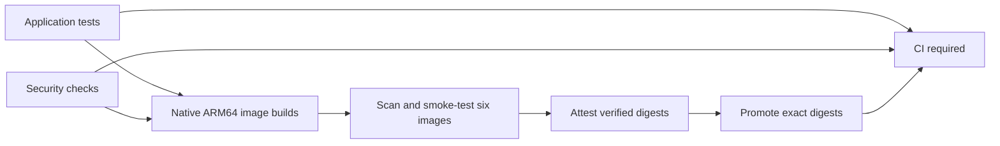

# CI and verified container images

DevFeed uses one CI entry point and the centrally maintained
[abhi1693/actions](https://github.com/abhi1693/actions) workflows at `@v1`.
Application scripts own the tests and runtime checks; shared workflows own
installation, auditing, native builds, SBOMs, attestations and image promotion.



## Triggers and gates

`.github/workflows/ci.yml` runs for pull requests, merge queues, pushes to
`master`, `v*` tags, manual dispatch and weekly maintenance. Pull requests,
merge queues and scheduled runs verify images without publishing. Master and
version-tag pushes publish after the tests and security checks pass. A manual
branch run explicitly trusts its selected branch for publication; Dependabot
cannot publish.

Branch protection requires **CI required**, which checks the result of the
application, security and container workflows. Failed or skipped prerequisites
cannot satisfy this gate. Cancelled runs do not count as successful validation.

The application gates run Python lint, type checks, unit and integration tests;
admin client generation, lint, tests and build; and user UI lint, tests and build.
`scripts/ci/python-tests.sh` creates disposable PostgreSQL, Redis and Typesense
services on local random ports and cleans them up on exit. It also enables the
database recovery test, which owns a separate PostgreSQL/PgBouncer network and
verifies recovery after a connection failure. CI requires every selected test to
run: skipped tests fail the report gate. It does not use production data.
Repository-owned scripts remain responsible for generated-code drift and test
report validation.

Security checks cover locked Python and Node dependencies, secrets, workflow
syntax, Compose configuration and CodeQL. CodeQL analyzes Python,
JavaScript/TypeScript and GitHub Actions. Findings block CI except the explicitly
listed first-party `abhi1693/actions` major refs in the security caller. Those
unpinned-ref warnings remain in SARIF for visibility; other refs and findings
remain blocking. This deliberate trust policy lets compatible workflow fixes
reach applications from one maintained release channel.

## Images and tags

`.github/images.json` declares six ARM64 images under
`ghcr.io/abhi1693/devfeed.tech`: `backend`, `admin-api`, `user-api`, `admin`, `web`
and `codex`. The Chimely upstream image remains independently maintained.
The shared `container-images.yml` workflow constructs native runner matrices
from this manifest and calls `docker-build-push.yml` for each component.

| Publication source | Image tag | Policy |
| --- | --- | --- |
| Master push or manual master run | `master` | Moves to the verified digest |
| Manual run on another branch | Sanitized branch name | Moves to that branch's verified digest |
| Version tag such as `v0.0.1` | `0.0.1` | Cannot replace an existing different digest |

Branch names use the shared normalization policy: unsupported tag characters
become hyphens. Use distinct names after normalization. Release versions must
match `pyproject.toml`. DevFeed disables the optional `latest` alias.

Each native build generates a CycloneDX SBOM and scans HIGH/CRITICAL OS and
library vulnerabilities, including unfixed findings, and secrets. Application
smoke scripts exercise the built runtime. BuildKit produces provenance and SBOM
attestations. Publishing runs push temporary candidates, verify their platform
indexes, add GitHub attestations, and only then promote the exact verified
digests. Candidate and build-cache tags are not deployment references.

Promotion checks every immutable version tag before changing final tags.
Registry authentication or transport errors are fatal. An existing version may
be reused only for the same digest; different image bytes require a new version.
The guard applies to this pipeline; use digest references for deployments.

Successful publication retains an `image-manifest-images-<run-id>-<run-attempt>`
artifact for 90 days. It records the source revision, run, version, platforms and
published image digest references. A deployment should consume that exact run's
manifest and verify attestations with `gh attestation verify`, then store approved
digests in the deployment repository. CI does not deploy services or reset data.

## Maintenance

The weekly run checks the current source against refreshed advisories without
publishing. Dependency and base-image updates create new source commits and
must pass the same gates. Shared implementation updates arrive through `@v1`;
application manifests, test scripts and narrow scanner exceptions stay here.

Useful local checks:

```sh
uv sync --all-packages --locked
bash scripts/ci/python-tests.sh
npm ci
npm run admin:lint
npm run admin:test
npm run admin:build
go run github.com/rhysd/actionlint/cmd/actionlint@v1.7.12
```
