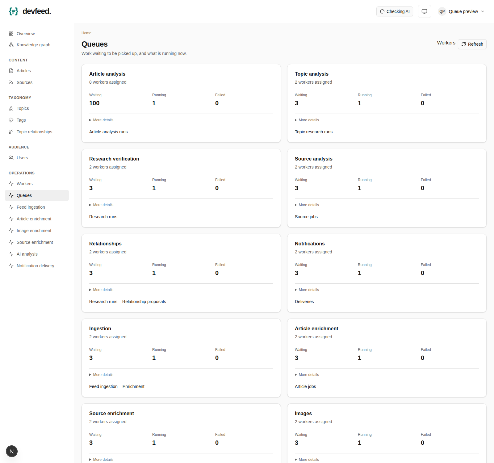

# Dedicated worker queues

Each pipeline has a physical Redis queue so you can scale its consumers independently.
For example, a topic worker can process research while article analysis has a backlog.

| Queue / `devfeed worker --queue` | Work                                                       |
| -------------------------------- | ---------------------------------------------------------- |
| `article-analysis`               | Article classification and relevance                       |
| `topic-analysis`                 | Topic metadata research                                    |
| `research-verification`          | Verification of topic and relationship research            |
| `relationships`                  | Topic relationship research                                |
| `source-analysis`                | AI relevance checks for submitted sources                  |
| `notifications`                  | Admin and user notification delivery                       |
| `ingestion`                      | Feed ingestion and recommendation refreshes                |
| `article-enrichment`             | Article page extraction                                    |
| `source-enrichment`              | Source profile enrichment                                  |
| `images`                         | Article image lookup                                       |
| `solver`                         | Enrichment explicitly routed to configured solver services |

Run separate processes or deployments from the same backend image:

```sh
devfeed worker --queue article-analysis
devfeed worker --queue topic-analysis
devfeed worker --queue research-verification
devfeed worker --queue notifications
```

Each process executes one job at a time. Increase replicas for the queue that needs more
capacity. Use a unique `--name` per process if assigning names yourself. The default RQ
name is unique; Compose creates a new name on every container startup.

The existing groups remain supported:

- `all` (default): ingestion, enrichment and images, plus AI and notifications when enabled.
- `background`: ingestion, enrichment and images, plus enabled notifications.
- `analysis`: every AI queue and the legacy physical `analysis` queue.
- `solver` is always explicit and requires configured solver services.

`analysis` is a compatibility group, not an article-only worker. Use
`article-analysis` for that. Explicit queue selection starts only that consumer,
except for the documented groups. Feature flags still determine what producers
schedule and whether execution is allowed. Keep AI enabled on ingestion/enrichment
producers when they should create subsequent analysis jobs.

Each physical AI queue receives its own scheduler batch allowance. Within a queue,
due-time ordering, exclusive database claims, retries, leases and readiness checks
remain in effect. Both research verification types share the verification queue and
its FIFO dispatch budget; their existing automatic approval flags still apply.
Codex outages and shared capacity cooldowns pause AI consumption without spending
attempts or pausing background queues.

## Compose

The optional `workers` profile adds one service per dedicated queue (except solver).
Each service uses `DEVFEED_<QUEUE>_WORKER_REPLICAS`, with hyphens replaced by underscores,
and defaults to one replica. Normal Compose startup retains the existing mixed worker.

With a local Codex server, enable both profiles. This example runs eight article
analysis workers, two topic workers and two notification workers:

```sh
docker compose --profile ai --profile workers up -d \
  --scale worker=0 --scale codex-client=0 \
  --scale article-analysis-worker=8 \
  --scale topic-analysis-worker=2 \
  --scale notifications-worker=2
```

Include `-f compose.yaml -f compose.build.yaml --build` when building local source,
as described in [Compose setup](compose.md). With an external Codex endpoint, the
`workers` profile alone is sufficient; configure `DEVFEED_CODEX_APP_SERVER_URL`.
Dedicated AI services mount the Codex socket but do not receive Chimely management
credentials. Only the notification service receives those credentials.

You can start or scale selected services instead of enabling the entire profile.
If you remove mixed workers, supply consumers for every enabled queue. Leave the
`solver` deployment configured separately. Worker count can be increased independently,
but total throughput still depends on database, network and shared Codex capacity.

## Upgrade and rollback

No database migration or Redis queue rewrite is needed for this change.

1. Upgrade existing consumers first, retaining at least one updated `all` worker,
   or updated `background` plus `analysis` workers. These consume both the new
   queues and deliveries already in legacy `analysis` / `ingestion` queues.
2. Upgrade every producer: scheduler, APIs and any CLI containers. New publications
   then use the dedicated queues. Add dedicated workers at the desired capacity.
3. Keep an updated `analysis` group consumer until the legacy `analysis` queue
   has no waiting or in-flight jobs and all old producers have stopped. Then remove
   the group consumer if all dedicated AI queues have consumers.

Existing deliveries keep their identity and position. A scheduler redispatch does
not move or duplicate a waiting/running legacy delivery; it still needs its legacy
consumer. A terminal transport failure can be republished to the new queue.
An `ingestion` consumer continues to execute legacy enrichment deliveries until
they drain. Do not flush Redis or delete queued jobs to change the topology.

During rollback, revert producers first and retain updated consumers until the new
queues and their in-flight jobs have drained. Old worker binaries do not consume
the new physical queues.

## Monitoring

Admin **Workers** and **Queues** show each queue's registered consumers, backlog,
durable failures and completed work. The legacy `analysis` row reports transport
depth/capacity; durable outcomes appear under their current destination queue.
While legacy deliveries drain, a durable job's destination and its Redis origin
can therefore differ.

`devfeed status` includes `queue_depths` for every physical queue and each worker's
assigned queues. `analysis_queue_depth` sums all AI queues, including legacy
deliveries. RQ completion counters describe transport execution; database outcomes
remain authoritative for application success.

Example queue dashboard using synthetic counts:


