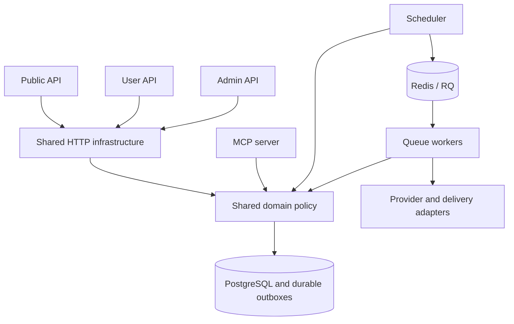

# Backend service boundaries

DevFeed keeps its source in one uv/npm workspace and deploys separate public,
account, administration, MCP, scheduler and worker processes. The PostgreSQL
schema and domain library are still shared. This is an incremental service
architecture: independent processes do not yet provide independent data ownership.

## Dependency rules

- `packages/core` owns domain policy and persistence contracts. It must not import
  application packages or HTTP infrastructure. Worker handler names in
  `job_definitions.py` are strings; reading or dispatching metadata never imports
  the handler or its credentials.
- `packages/http` owns reusable HTTP infrastructure and may depend on core.
  `HTTPService` composes lifecycle, admission, logging, errors and health routes.
  Apps supply their own dependencies and resources. Authentication, authorization,
  account policy and admin Codex resources remain in their respective apps.
- API, MCP, scheduler and notification apps must not import another application.
  CLI commands and dedicated worker launchers have explicit adapter exceptions
  in `tests/test_backend_boundaries.py`. Existing launcher imports and durable RQ
  handler paths remain compatible with queued work.
- A worker performs external work only after committing its claim, and checks its
  lease and current domain revisions before applying results. Only database work
  belongs inside a retried transaction. `ArticleAnalysisService` separates
  preparation, inference, proposals, application and failure handling.
- Notification retry, expiry and lease recovery use `DeliveryPolicy` in core.
  Sending HTTP requests belongs to `apps/notifications`; the scheduler needs no
  delivery adapter. Lightweight aggregator installations omit that package.
  Install `devfeed-aggregator[notifications]` for a generic worker that consumes
  notifications, or `[all-workers]` for all handlers. The existing CLI and default
  backend image use `[all-workers]` and retain delivery support.

The import guard checks all Python workspace members during ordinary backend
unit tests. Fresh-process tests also prove each HTTP API loads without importing
another application. These checks cover Python imports, not network access,
database privileges or every dynamically loaded handler.

## Continuing the migration

Start each further extraction with a domain owner and a stable operation/event
contract. Keep shared infrastructure separate from domain orchestration, and use
composition and explicit dependencies instead of a large base-service hierarchy.

The next data boundaries are account preferences and engagement, publication and
taxonomy, search projections, and notification delivery. Move their writes behind
owner-specific application services before splitting databases. Cross-owner
delivery should use versioned durable outbox events, idempotent consumers and
reconciliation, following the existing search and notification outbox behavior.
Preserve atomic writes until a tested event contract replaces them; do not replace
in-process calls with synchronous network hops just to create more services.

Before a domain gets its own database, document its consistency requirements,
remove direct foreign-domain writes, backfill and reconcile its projection, test
consumer retries and rollout compatibility, and give the owner separate runtime
credentials and deployment health checks. Those steps require a separate reviewed
migration; this refactor changes neither schema ownership nor deployment topology.
